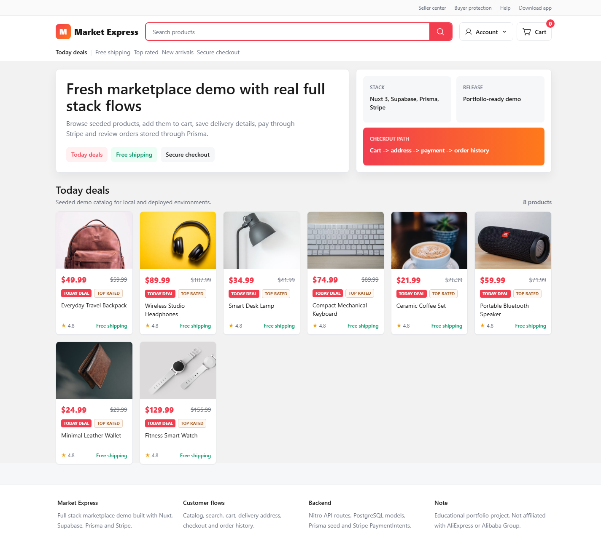
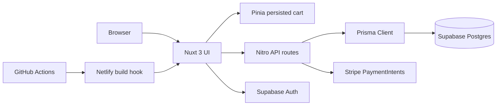
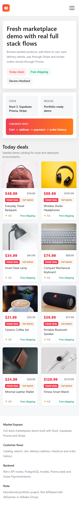

# Market Express

[](https://github.com/StepanDrogin/ali-clone/actions/workflows/ci-cd.yml)
[](https://github.com/StepanDrogin/ali-clone/actions/workflows/release.yml)
[](https://app.netlify.com/projects/market-express-ali-clone/deploys)

Portfolio-ready full stack marketplace demo built with Nuxt 3, Supabase Auth, Prisma/PostgreSQL, Pinia and Stripe PaymentIntents.

[Live production](https://market-express-ali-clone.netlify.app) · [Production runbook](docs/production.md) · [Release process](docs/release-process.md)



## What It Does

Market Express keeps the familiar marketplace journey but turns the old demo into a production-shaped Nuxt app:

- Browse seeded products, search the catalog and open product detail pages.
- Add products to cart, persist checkout state and complete a Stripe test payment.
- Sign in through Supabase OAuth, save a shipping address and review stored orders.
- Serve production health, robots and sitemap endpoints through Nitro API routes.
- Deploy as a Netlify server app with Prisma-backed Supabase Postgres data.

## Architecture



## Stack

- Nuxt `3.21`, Vue `3.5`, Nitro for server routes.
- Tailwind CSS module with project tokens in `tailwind.config.ts`.
- Shared UI classes: `ui-button`, `ui-span`, `ui-title`.
- Supabase Nuxt module for OAuth and session state.
- Prisma `4.16` with Netlify-compatible `rhel-openssl-3.0.x` binary target.
- Stripe Node SDK and Stripe.js for test-mode checkout.
- GitHub Actions for CI, production deploy triggers and GitHub Releases.

## Screenshots

| Desktop | Mobile |
| --- | --- |
|  |  |

Design reference: [docs/screenshots/concept-marketplace.png](docs/screenshots/concept-marketplace.png)

## Local Development

```bash
npm install
cp .env.example .env
npm run db:generate
npm run db:migrate:deploy
npm run db:seed
npm run dev
```

Required app variables:

| Variable | Used by |
| --- | --- |
| `DATABASE_URL` | Prisma and Supabase Postgres |
| `NUXT_PUBLIC_SITE_URL` | absolute URLs for metadata/sitemap |
| `NUXT_PUBLIC_SUPABASE_URL` | Supabase client |
| `NUXT_PUBLIC_SUPABASE_KEY` | Supabase anon/publishable key |
| `STRIPE_PK_KEY` | Stripe.js |
| `STRIPE_SK_KEY` | Stripe server SDK |

For local UI-only preview, safe placeholder Supabase values are enough. Real auth, address, checkout and order flows require valid Supabase, PostgreSQL and Stripe credentials.

## CI/CD

The repository ships with GitHub Actions workflows:

| Workflow | Trigger | Purpose |
| --- | --- | --- |
| `CI / CD` | pull request, push to `main`, push to `s.drogin/**`, manual dispatch | install, validate env contract, build Netlify/Nitro bundle, audit dependencies |
| `CI / CD` deploy job | push to `main` or manual dispatch with `deploy=true` | trigger the Netlify production build hook after CI passes |
| `Release` | tag `v*.*.*` or manual dispatch | build, audit, create GitHub Release, trigger Netlify deploy |

Only one GitHub repository secret is required for automated deployment:

```text
NETLIFY_BUILD_HOOK
```

Create it in Netlify for the `main` branch, then add the URL in GitHub repository secrets. Production app secrets stay in Netlify, so GitHub Actions does not need `DATABASE_URL`, Stripe keys or Supabase keys.

## Commands

```bash
npm run ci:check
npm run build:netlify
npm run prod:check
npm audit --audit-level=moderate
```

Operational endpoints:

- [Health](https://market-express-ali-clone.netlify.app/api/health)
- [Robots](https://market-express-ali-clone.netlify.app/robots.txt)
- [Sitemap](https://market-express-ali-clone.netlify.app/sitemap.xml)

## Releases

- [v1.0.0 refreshed full stack demo](docs/releases/v1.0.0.md)

Release options:

- Push a semver tag: `git tag -a v1.1.0 -m "Release v1.1.0" && git push origin v1.1.0`.
- Run the `Release` workflow manually with a version input.
- Add curated notes to `docs/releases/vX.Y.Z.md` before tagging when a release needs a hand-written changelog.

## Project Structure

```text
components/       reusable Vue components
layouts/          application shell
pages/            Nuxt pages and marketplace flows
server/api/       Nitro API routes for Prisma, Stripe and health
server/routes/    robots and sitemap routes
server/utils/     shared server utilities
prisma/           schema, migrations and seed data
docs/             screenshots, runbooks and release notes
.github/          CI/CD and release automation
```

## Disclaimer

This is an educational portfolio project. It is not affiliated with AliExpress, Alibaba Group, Supabase or Stripe.
