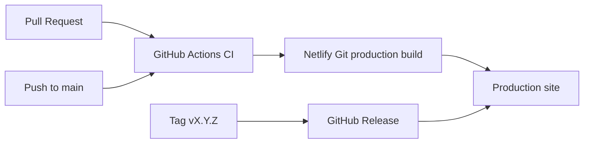

# Production Runbook

This project deploys to Netlify as a Nuxt/Nitro server app backed by Supabase Postgres, Prisma and Stripe.

## Production Environment

Configure these variables in Netlify before a production deploy:

```text
DATABASE_URL
NUXT_PUBLIC_SITE_URL
NUXT_PUBLIC_SUPABASE_URL
NUXT_PUBLIC_SUPABASE_KEY
STRIPE_PK_KEY
STRIPE_SK_KEY
AWS_LAMBDA_JS_RUNTIME=nodejs22.x
```

Do not commit real values to the repository. GitHub Actions should not store the app database URL or Stripe secret key; Netlify owns production app secrets.

## Netlify Git Deploy

Automated production deploys use the Netlify Git integration on the `main` branch. GitHub Actions builds and audits the app with safe placeholders, while Netlify owns the real production app secrets.

1. Open the `aliclone-drogin` site in Netlify.
2. Confirm the Git provider is connected to `StepanDrogin/ali-clone`.
3. Confirm the production branch is `main`.
4. Keep production values in Netlify environment variables.

## Database Release

Run migrations before the first production deploy and whenever Prisma migrations change:

```bash
npm run db:migrate:deploy
```

Seed the demo catalog only when the target database is empty or intentionally reset:

```bash
npm run db:seed
```

## Local Production Check

```bash
npm install
npm run ci:check
npm audit --audit-level=moderate
```

To force the same environment validation used by Netlify production builds:

```bash
REQUIRE_PRODUCTION_ENV=true npm run validate:production-env
```

PowerShell:

```powershell
$env:REQUIRE_PRODUCTION_ENV = 'true'
npm run validate:production-env
Remove-Item Env:\REQUIRE_PRODUCTION_ENV
```

## Deployment Flow



Manual deploy fallback:

```bash
npx netlify login
npx netlify link --git-remote-url https://github.com/StepanDrogin/ali-clone.git
npm run deploy:preview
npm run deploy:prod
```

## Post-Deploy Checks

Check these URLs after every release:

```text
https://aliclone-drogin.netlify.app/
https://aliclone-drogin.netlify.app/api/health
https://aliclone-drogin.netlify.app/api/prisma/get-all-products
https://aliclone-drogin.netlify.app/robots.txt
https://aliclone-drogin.netlify.app/sitemap.xml
```

For checkout smoke tests, create a small Stripe test PaymentIntent through the app flow and avoid logging `client_secret`.

## Rollback

Use Netlify Deploys to restore the last healthy deploy if production checkout, auth or catalog flows regress.
